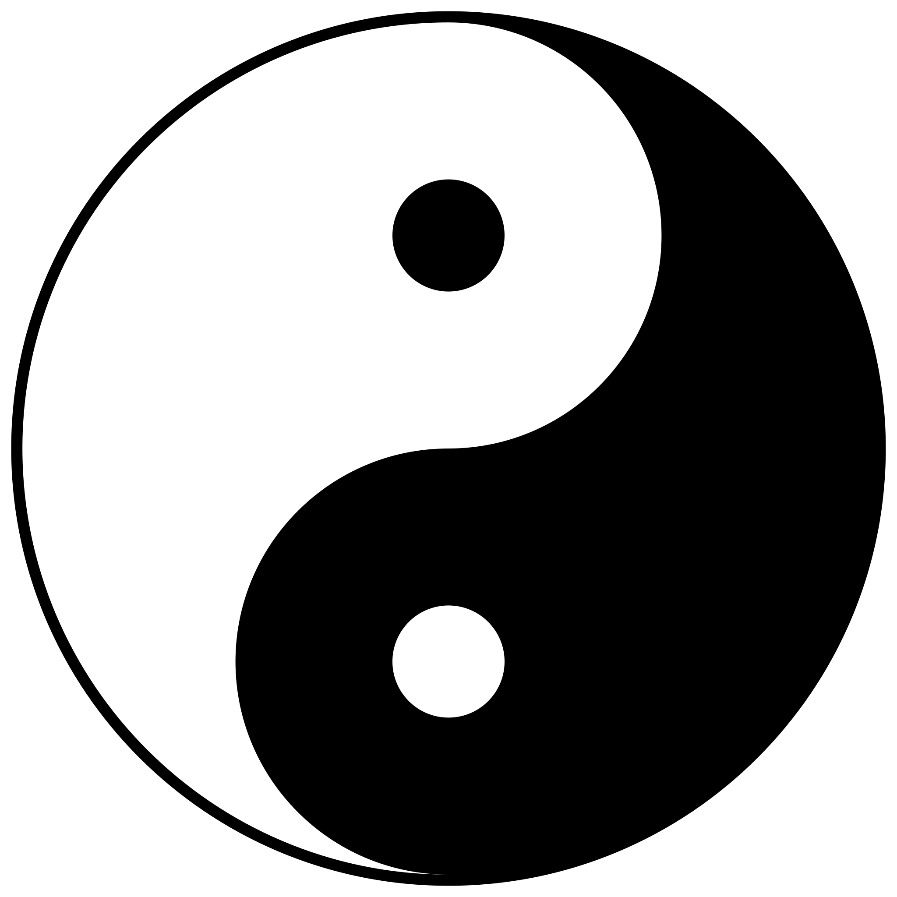

# CLAUDE.md

此文件为 Claude Code (claude.ai/code) 提供在此代码库中工作的指导。

## 项目概述

这是一个**多语言太极拳教育培训网站**，是学习中国武术和哲学的综合资源。该项目是一个**静态网站**，无构建流程或包管理器

**支持语言：** 荷兰语 (nl)、中文 (zh)、英语 (en)
**默认语言：** 荷兰语

## 开发流程
### Git 操作
仓库使用中文提交信息。创建提交：
```bash
git add <files>
git commit -m "提交信息"
```

每次新功能后总是执行推送（push）到远程仓库：
```bash
git push 
```

### 文件操作
- 直接编辑 HTML 文件 - 无需模板系统或构建步骤
- CSS 更改会立即生效
- JavaScript 模块通过标准 `<script>` 标签加载

## 路径规范（重要）

**⚠️ 部署环境要求：** 该网站可能部署在网站根路径下（如 `https://example.com/`），也可能部署在二级目录下（如 `https://example.com/taichi/`）。因此，**所有链接必须使用相对路径**，不能使用绝对路径（以 `/` 开头）。

### 路径规则

**❌ 错误示例（绝对路径）：**
```html
<link rel="stylesheet" href="/css/style.css">
<script src="/js/language-switcher.js"></script>
<a href="/nl/pages/zhan-zhuang.html">桩功</a>

```

**✅ 正确示例（相对路径）：**
```html
<!-- 在 /index.html 中 -->
<link rel="stylesheet" href="css/style.css">


<!-- 在 /nl/index.html 中 -->
<link rel="stylesheet" href="../css/style.css">
<a href="pages/zhan-zhuang.html">桩功</a>

<!-- 在 /nl/pages/zhan-zhuang.html 中 -->
<link rel="stylesheet" href="../../css/pages-style.css">
<script src="../../js/language-switcher.js"></script>
<a href="../index.html">返回首页</a>

```

### 各级目录的相对路径规范

**根目录 (`/index.html`)：**
```html
css/style.css          → css/style.css
js/language-switcher.js → js/language-switcher.js
images/taichi.png      → images/taichi.png
nl/index.html          → nl/index.html
```

**语言首页 (`/nl/index.html`, `/zh/index.html`, `/en/index.html`)：**
```html
css/style.css          → ../css/style.css
js/language-switcher.js → ../js/language-switcher.js
images/taichi.png      → ../images/taichi.png
pages/zhan-zhuang.html → pages/zhan-zhuang.html
../index.html          → ../index.html (根语言选择页)
```

**详情页 (`/nl/pages/*.html`, `/zh/pages/*.html`, `/en/pages/*.html`)：**
```html
css/pages-style.css        → ../../css/pages-style.css
js/language-switcher.js    → ../../js/language-switcher.js
images/taichi.png          → ../../images/taichi.png
../index.html              → ../index.html (返回语言首页)
pages/other-technique.html → pages/other-technique.html
```

### 检查清单
添加或修改文件时，请确保：
- [ ] 所有 `<link>` 标签使用相对路径
- [ ] 所有 `<script>` 标签使用相对路径
- [ ] 所有 `<a>` 标签使用相对路径
- [ ] 所有 `` 标签使用相对路径
- [ ] hreflang 标签也使用相对路径

## 架构

### 目录结构
```
taichi/
├── index.html              # 语言选择首页，带自动跳转
├── css/
│   ├── style.css          # 首页样式（太极动画、画廊）
│   └── pages-style.css    # 详情页通用样式
├── js/
│   └── language-switcher.js  # 语言切换组件
├── locales/               # JSON 翻译文件 (nl.json, en.json, zh.json)
├── images/                # 太极图片和素材
└── nl/                    # 荷兰语内容（默认/主语言）
    ├── index.html         # 荷兰语主页
    └── pages/             # 各个技法页面
```

### 语言架构

**基于 URL 的路由：**
- `/nl/` - 荷兰语版本
- `/zh/` - 中文版本
- `/en/` - 英语版本
- `/index.html` - 根语言选择器

**语言检测优先级**（在 `/index.html` 中）：
1. `localStorage.getItem('preferredLanguage')` - 保存的用户偏好
2. URL 参数 `?lang=xx`
3. 浏览器语言检测
4. 默认为 `nl`（荷兰语）

**语言切换器组件** (`/js/language-switcher.js`)：
- 从 URL 路径自动检测当前语言
- 切换语言的下拉 UI
- 将偏好保存到 localStorage
- 在 `.container` 中的 `<h1>` 之后插入自己

### 页面模板

**首页** (`/nl/index.html`)：
- 带太极动画的横幅区域
- 哲学卡片（阴阳、练习、健康）
- 画廊包含 16+ 个技法卡片，按类别组织（基本功、套路、器械、推手）
- 图片查看的灯箱功能
- 分类筛选标签

**详情页** (`/nl/pages/*.html`)：
- 使用 `/nl/pages/template.html` 作为参考（该模板已包含正确的相对路径）
- 通用结构：
  - 返回首页按钮
  - 标题区：标题、中文名、副标题
  - 章节：简介、技法与动作、要点、常见错误、相关技法
- 导入 `/css/pages-style.css` 以保持样式一致
- 包含语言切换器：`<script src="/js/language-switcher.js"></script>`

### 样式架构

**设计理念：**
- 传统中式美学，配水墨印章、宣纸纹理
- 字体：楷体 (KaiTi)、STKaiti、宋体 (SimSun)、STSong 以保持真实性
- 色彩方案：大地色调（背景 #f5f2ed）、深炭灰 (#2a2a2a)、红色点缀 (#cc3333)
- 动画：20秒旋转太极符号、淡入效果、悬停过渡

**CSS 文件：**
- `/css/style.css` - 仅首页（817行）：太极动画、画廊网格、灯箱、语言切换器
- `/css/pages-style.css` - 详情页（369行）：返回按钮、章节、步骤列表、提示、错误、相关技法

**关键 CSS 类：**
- `.taichi-container` - 旋转太极符号包装器
- `.gallery-item` - 带悬停遮罩的技法卡片
- `.lightbox` - 全屏图片查看器
- `.section` - 带背景模糊的内容块
- `.steps li` - 编号步骤列表（通过 CSS 计数器自动编号）

### 翻译系统

**JSON 结构** (`/locales/*.json`)：
```json
{
  "language": "nl",
  "home": { "title": "...", "subtitle": "..." },
  "cards": { "philosophy": {...}, "practice": {...}, "health": {...} },
  "gallery": { "title": "...", "tabs": {...} },
  "items": { "zhanZhuang": {...}, "cloudHands": {...}, ... },
  "detailPage": { "backToHome": "...", ... }
}
```

**注意：** JSON 文件目前尚未完全集成到 HTML 中。内容主要硬编码为荷兰语。添加多语言支持时，您需要：
1. 使用 JSON 文件创建客户端翻译系统
2. 为每种语言维护单独的 HTML 文件（当前方法）

## 常见任务

### 添加新技法页面
1. 复制 `/nl/pages/template.html`
2. 用实际内容替换占位符变量（`{{TITLE}}`、`{{CHINESE_NAME}}` 等）
3. **⚠️ 确保所有路径使用相对路径**（参考上方"路径规范"章节）
4. 在 `/nl/index.html` 画廊区添加链接（使用相对路径 `pages/xxx.html`）
5. 将相应图片添加到 `/images/`（引用时使用 `../../images/xxx.jpg`）
6. 如果使用翻译系统，更新 `/locales/nl.json`

### 更新样式
- 首页更改：编辑 `/css/style.css`
- 详情页更改：编辑 `/css/pages-style.css`
- 两个文件共享基础样式（body 背景、字体）

### 添加新语言
1. 创建目录 `/xx/`，镜像 `/nl/` 结构
2. 创建 `/locales/xx.json` 翻译文件
3. 在 `/js/language-switcher.js` 的 `supportedLanguages` 数组中添加语言
4. 在语言切换器的 `languageNames` 对象中添加语言名称
5. 在 HTML 头部添加 hreflang 标签

## 重要实现细节

### 画廊灯箱
- 键盘导航：Escape 关闭，方向键导航
- 遵守分类筛选（仅显示可见项目）
- 动态跟踪可见项目
- 位于 `/nl/index.html` 底部

### 太极动画
- 纯 CSS 动画：`rotate 20s linear infinite`
- 应用于 `.taichi-container`
- 图片：`/images/taichi.png`

### 语言切换器定位
- 桌面端：`position: absolute; top: 20px; right: 20px`
- 移动端：`position: static`，下拉菜单右对齐

### 提交信息风格
最近的提交使用中文格式：
```
feat(多语言支持): 添加多语言切换功能并重构页面样式
feat: 添加太极网站基础页面和样式
```

提交更改时请遵循此约定。

## 文件依赖

**首页依赖：**
- `/css/style.css`
- `/js/language-switcher.js`
- `/images/` 中的图片

**详情页依赖：**
- `/css/pages-style.css`（或模板中的内联样式）
- `/js/language-switcher.js`

**所有页面链接到：**
- 通过 `<link rel="alternate" hreflang="...">` 链接到其他语言版本
